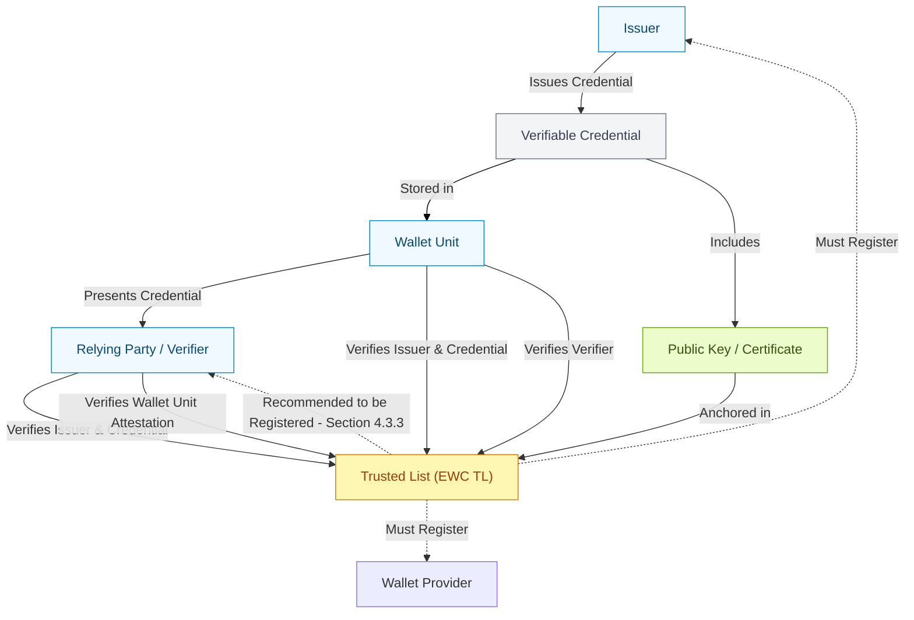

## ETSI trust status lists (aka ETSI 119 612 v2)

This is a golang library implementing ETSI trust status lists. The library is meant to be used primarily to create a certificate pool for validating X509 certificates.

## Trust List in Infrastructure: General Overview:

Document for the reference:
https://github.com/EWC-consortium/eudi-wallet-rfcs/blob/main/ewc-rfc012-trust-mechanism.md#433-relying-parties

## Contributing

If you want to "make gen" to re-generate the golang from the etsi XSD then you must install https://github.com/xuri/xgen first. Note that the generated code is post-processed (sed) to fix a couple of "features" in xgen that I am too lazy to pursue as bugs in xgen at this point. This stuff may change so run "make gen" at your own peril. The generated code that is known to work is commited into the repo for this reason - ymmw.

